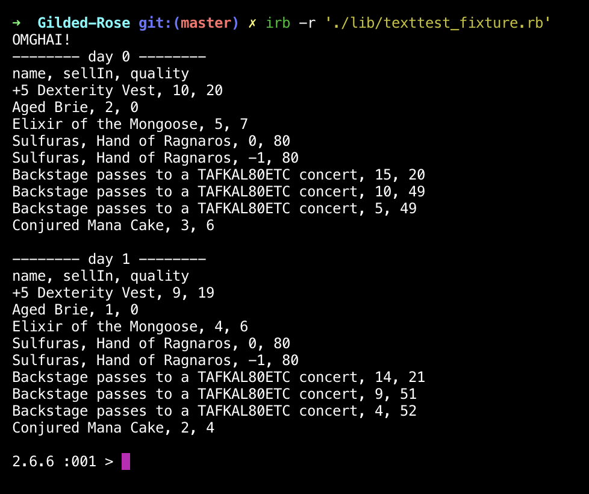

# Gilded rose tech test

This is the first version of my completed Gilded Rose tech test, as explained below:

*"Hi and welcome to team Gilded Rose. As you know, we are a small inn with a prime location in a prominent city run by a friendly innkeeper named Allison. We also buy and sell only the finest goods. Unfortunately, our goods are constantly degrading in quality as they approach their sell by date. We have a system in place that updates our inventory for us. It was developed by a no-nonsense type named Leeroy, who has moved on to new adventures. Your task is to add the new feature to our system so that we can begin selling a new category of items. First an introduction to our system:

All items have a SellIn value which denotes the number of days we have to sell the item.
All items have a Quality value which denotes how valuable the item is.

At the end of each day our system lowers both values for every item. Pretty simple, right? Well this is where it gets interesting:

Once the sell by date has passed, Quality degrades twice as fast
The Quality of an item is never negative
“Aged Brie” actually increases in Quality the older it gets
The Quality of an item is never more than 50
“Sulfuras”, being a legendary item, never has to be sold or decreases in Quality
“Backstage passes”, like aged brie, increases in Quality as it’s SellIn value approaches; Quality increases by 2 when there are 10 days or less and by 3 when there are 5 days or less but Quality drops to 0 after the concert

We have recently signed a supplier of conjured items. This requires an update to our system:

“Conjured” items degrade in Quality twice as fast as normal items

Feel free to make any changes to the UpdateQuality method and add any new code as long as everything still works correctly.

However, do not alter the Item class or Items property as those belong to the goblin in the corner who will insta-rage and one-shot you as he doesn’t believe in shared code ownership (you can make the UpdateQuality method and Items property static if you like, we’ll cover for you)."*

## Dependencies

* Rspec (testing)
* Simplecov (test coverage)
* Simplecov-console (test coverage)
* Rubocop (linting)
* Rubocop-rspec (linting)
* Relaxed-Rubocop (linting rules)

## Installation

* Clone this Repo
* cd to the project directory
* Bundle install

## Running tests

* cd to the project directory
* rspec to run tests

## Usage

irb -r './lib/texttest_fixture.rb'



Simplecov reports 100% test coverage.

Feel free to change variables within texttest_fixture to obtain different results. For example:

```ruby
items = [Item.new(name="A pretty parrot", sell_in=10, quality=20)] # creates an array containing a new object called parrot
shop = GildedRose.new(items)
shop.print_items(7) # prints the way items change over 7 days
shop.update_quality # moves all items on in quality and sell-by date, by one day
```

## About this project

I began this project by testing. I created tests for all of the cases described in the information at the top of the README. I ensured that I understood the code by running the pre-given file, texttest_fixture.rb.

Having created tests for the pre-existing code, I deleted the 'update_quality' method and started again. I began by determining how many 'cases' there were. In fact, there were really only 4, so I decided to utilise a switch statement, in combination with a few other checks for special conditions. I created separate methods for each of the cases, except for "Sulfuras". For "Sulfuras", I just used 'next' because it did approach sell-by date or degrade in quality.

In addition to these special cases, I needed to ensure that item quality did not exceed 50, or become negative. I initially
